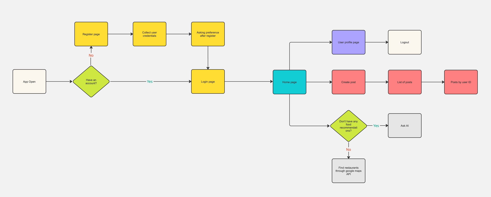

<div align="center">


# 🍽️ Foodie Finder

**Discover great places to eat, share your favorite spots, and ask an AI what to order — all from your phone.**

[](https://reactnative.dev/)
[](https://expo.dev/)
[](https://expressjs.com/)
[](https://www.mongodb.com/)
[](https://redis.io/)

</div>

---

## 📖 Overview

Foodie Finder is a cross-platform mobile app that helps food lovers find nearby
restaurants, build a community feed of recommendations, and get instant
AI-powered dining suggestions. It pairs a React Native (Expo) client with an
Express REST API backed by MongoDB and Redis.

https://github.com/ronaldokwan/Foodie-Finder/assets/108158859/d6924acc-3e92-454a-8cc9-d0d9f286956e

## ✨ Features

- 🔐 **Authentication** — secure register/login with JWT and bcrypt-hashed passwords.
- 📍 **Restaurant search** — find places to eat via the Google Places API, complete with photos.
- 📝 **Community feed** — create posts, like/dislike, and browse recommendations from other users.
- ❤️ **Favorites** — save the spots you love and revisit them anytime.
- 🤖 **Ask Us (AI)** — chat with an AI assistant for personalized food and dining advice.
- 🎯 **Preferences** — tailor recommendations to your taste.
- ⚡ **Redis caching** — faster responses on frequently requested data.

## 🛠️ Tech Stack

| Layer        | Technologies                                                              |
| ------------ | ------------------------------------------------------------------------- |
| **Client**   | React Native, Expo, React Navigation, React Native Elements, Axios        |
| **Server**   | Node.js, Express, JWT, bcrypt                                              |
| **Database** | MongoDB                                                                    |
| **Cache**    | Redis (ioredis)                                                           |
| **APIs**     | Google Places API (maps & photos), RapidAPI ChatGPT (AI assistant)        |
| **Testing**  | Jest, Supertest                                                            |

## 📂 Project Structure

```
Foodie-Finder/
├── client/FoodieFinder/   # Expo / React Native app
│   ├── screens/           # App screens (Home, Login, AddPost, AskUs, ...)
│   ├── navigators/        # Stack & tab navigation
│   └── context/           # Shared app context
└── server/                # Express REST API
    ├── controllers/       # Route handlers
    ├── models/            # MongoDB models (user, post, favorite)
    ├── routes/            # API routes
    ├── middlewares/       # Auth & error handling
    └── __test__/          # Jest test suite
```

## 🚀 Getting Started

### Prerequisites

- [Node.js](https://nodejs.org/) (v18+ recommended)
- [Expo CLI](https://docs.expo.dev/get-started/installation/) and the **Expo Go** app on your phone
- A MongoDB database and a running Redis instance
- API keys for **Google Places** and **RapidAPI (open-ai21)**

### 1. Backend

```bash
cd server
npm install
```

Create a `.env` file in `server/`:

```env
MONGO_URI=your_mongodb_connection_string
JWT_SECRET=your_jwt_secret
GOOGLE_MAPS_API=your_google_places_api_key
AI_KEY=your_rapidapi_key
AI_HOST=open-ai21.p.rapidapi.com
REDIS_HOST=your_redis_host
REDIS_PORT=your_redis_port
REDIS_PASS=your_redis_password
```

Start the API:

```bash
npm start        # runs nodemon bin/www
npm test         # run the Jest test suite with coverage
```

### 2. Mobile App

```bash
cd client/FoodieFinder
npm install
npm start        # then scan the QR code with Expo Go
```

You can also launch directly on a platform:

```bash
npm run android  # Android emulator / device
npm run ios      # iOS simulator / device
npm run web      # Web preview
```

## 🔌 API Reference

Base URL (deployed): `https://foodie-finder.naufalsoerya.online`

| Method   | Endpoint              | Auth | Description                       |
| -------- | --------------------- | :--: | --------------------------------- |
| `GET`    | `/`                   |  —   | Health / home                     |
| `POST`   | `/register`           |  —   | Create a new account              |
| `POST`   | `/login`              |  —   | Log in and receive a JWT          |
| `POST`   | `/maps`               |  —   | Search restaurants (Google Places)|
| `POST`   | `/ai`                 |  —   | Ask the AI assistant              |
| `GET`    | `/user`               |  ✓   | Get current user profile          |
| `PATCH`  | `/user/:id`           |  ✓   | Update preferences                |
| `GET`    | `/post`               |  ✓   | List posts                        |
| `POST`   | `/post`               |  ✓   | Create a post                     |
| `GET`    | `/post/:id`           |  ✓   | Posts by user id                  |
| `DELETE` | `/post/:id`           |  ✓   | Delete a post                     |
| `PATCH`  | `/like/:id`           |  ✓   | Like a post                       |
| `PATCH`  | `/unlike/:id`         |  ✓   | Remove a like                     |
| `PATCH`  | `/dislike/:id`        |  ✓   | Dislike a post                    |
| `PATCH`  | `/undislike/:id`      |  ✓   | Remove a dislike                  |
| `GET`    | `/favorite`           |  ✓   | List favorites                    |
| `POST`   | `/favorite/:idx`      |  ✓   | Add a favorite                    |
| `DELETE` | `/favorite/:id`       |  ✓   | Remove a favorite                 |

> Authenticated routes require an `Authorization: Bearer <token>` header.

## 🖼️ Screenshots

| Home | Login | Register |
| :--: | :---: | :------: |
|  |  |  |

| Create Post | My Favorites | Preferences |
| :---------: | :----------: | :---------: |
|  |  |  |

| Google Maps | Ask Us (AI) | Profile |
| :---------: | :---------: | :-----: |
|  |  |  |

## 🧭 Architecture



## 📄 License

Released under the ISC License.
